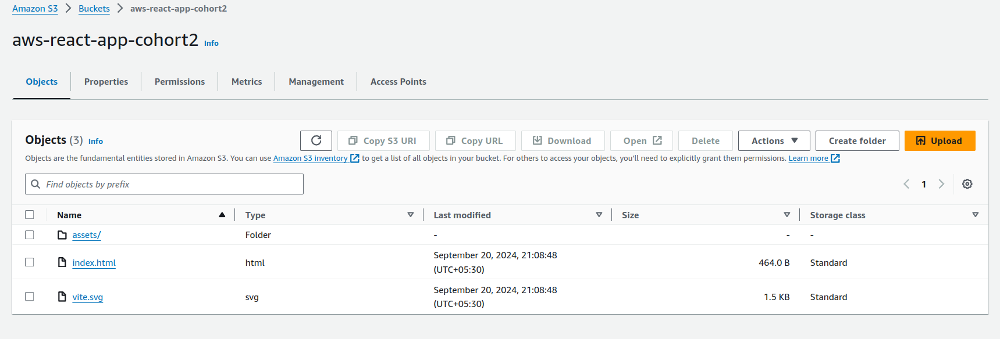
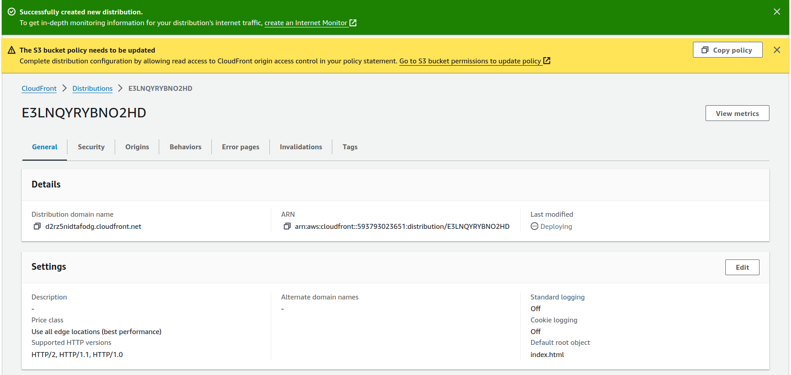
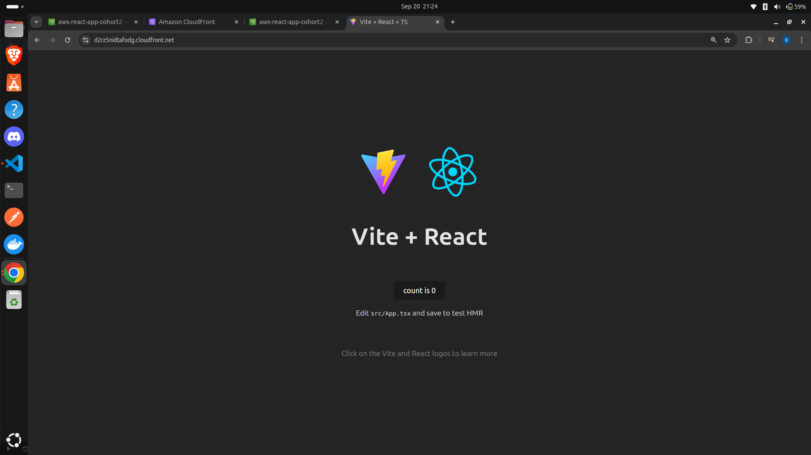

# React App Deployment on S3 & CloudFront

To deploy the React application, Static Sites (Not for Next), follow these steps:

1. **Build the Application**  
   After building the application, a `dist` folder will be generated.  
   Upload all the contents of this `dist` folder to the S3 bucket.

   

2. **Configure CloudFront**  
   Use CloudFront to map the S3 bucket so that public access is restricted.  
   Below is an example of the CloudFront configuration:

   

3. **Add HTTPS Certificates & Error Pages**  
   To ensure secure access via HTTPS, add SSL/TLS certificates.  
   Additionally, configure error pages to handle routes effectively.  
   (Note: This step may not be completed if a custom domain isn't set up yet.)

   Here's how the deployed frontend looks:

   
